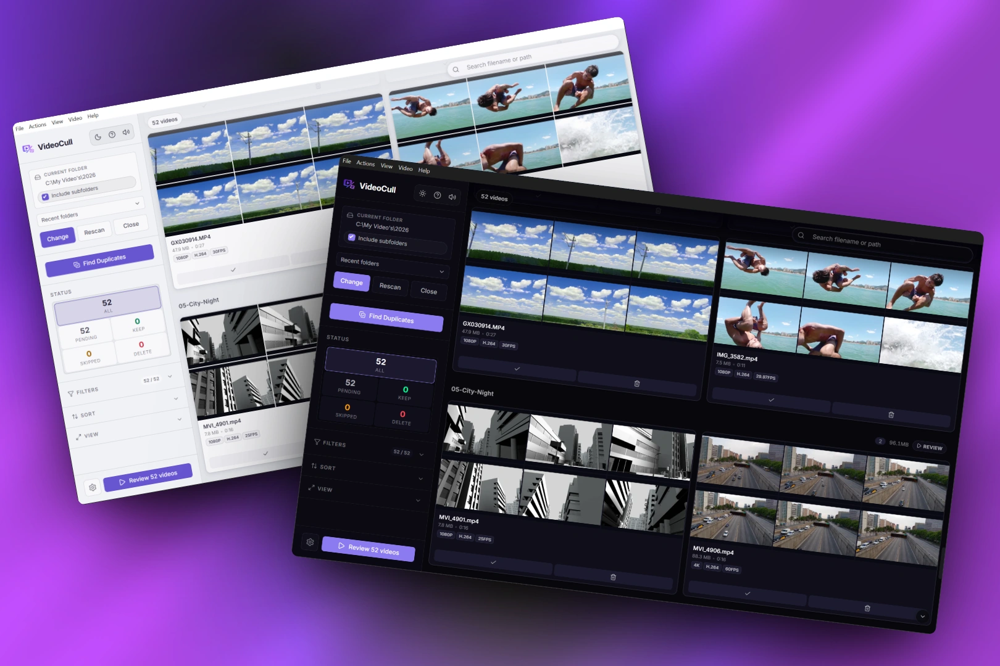
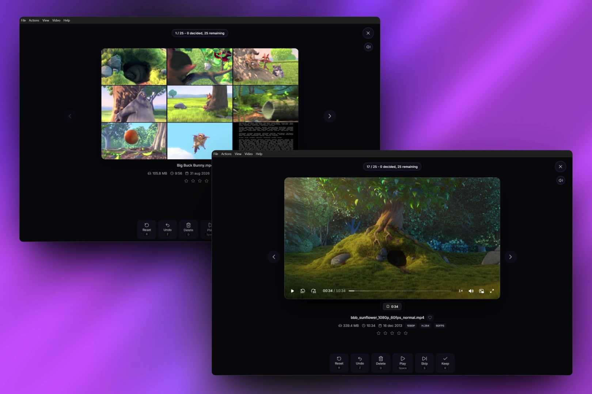
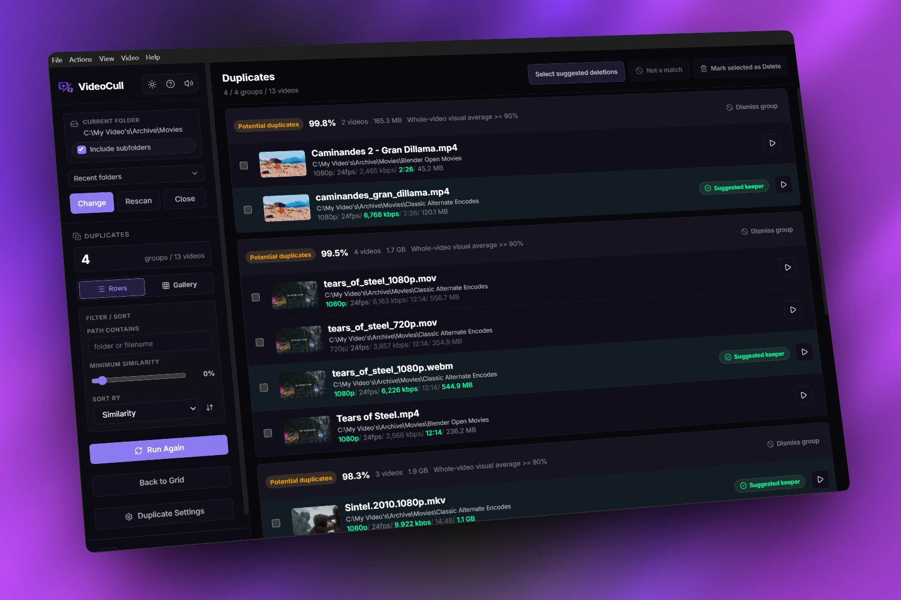

# VideoCull
[](https://github.com/StippieDot/VideoCull/releases)
[](LICENSE)
[](https://github.com/StippieDot/VideoCull/releases)
[](https://docs.videocull.app)
> See what is inside a video folder before deciding what stays.

VideoCull is a Windows desktop app for folders that are too large or messy to review file by file. It samples several frames from every video and lays them out in a grid, so you can identify clips without opening each one.

Make Keep, Delete, and Skip decisions from the grid or work through a focused keyboard queue. Play and scrub uncertain clips inside the app, add ratings or favorites, and review likely duplicates as separate comparison groups.

The workflow stays local. Marking Delete only changes the review state. Files move to the Windows Recycle Bin when possible after you inspect and confirm the complete batch.

---

## See VideoCull



| Review uncertain clips | Compare likely duplicates |
| --- | --- |
|  |  |

Demo footage shown in these screenshots includes [Blender Open Movies](https://studio.blender.org/films/), used under their applicable Creative Commons Attribution licenses.

---

## Download

Grab `VideoCull.Setup.<version>.exe` from the [Releases](https://github.com/StippieDot/VideoCull/releases) page.

The packaged installer is Windows-first, installs for the current user, and does not require admin rights. On first launch Windows may show a SmartScreen prompt since the app isn't code-signed yet; click "Run anyway" to proceed.

The installer lets you choose the install location and shortcuts. Later updates are handled in-app when a GitHub release is available.

### Updating from v2.2.0

VideoCull v2.2.1 renames the verified v2.2.0 profile at `%APPDATA%\video-cull` to `%APPDATA%\VideoCull` without copying its thumbnail cache. If Windows cannot perform the rename, the app leaves the old profile untouched, uses it for that launch, and tries again next time.

If both folders already exist, VideoCull does not merge or overwrite them. It uses `%APPDATA%\VideoCull`, keeps both folders, and shows which one is active. Existing installations stay in their current install directory. Windows may require you to re-pin the renamed app on the taskbar.

> [!IMPORTANT]
> **Official links:** Use [videocull.app](https://videocull.app/) for the product website, [docs.videocull.app](https://docs.videocull.app/) for documentation, and this GitHub repository for source and releases.
> 
> *Please beware of third-party domains (such as `.com` variants) offering downloads. They are NOT affiliated with this project and may contain modified or unsafe binaries.*

---

## Features

### Grid View

Every video gets a strip of thumbnails pulled from different points in the file. You know what you're looking at without opening anything.

- Adjustable card size (`Ctrl++` / `Ctrl+-`)
- Search by filename or path (`Ctrl+F` by default, customizable)
- Group by subfolder with per-folder counts and sizes
- Filter by exact status, minimum rating, favorites, compatibility, duplicates, file size, and duration
- Sort by name, size, duration, date, rating, resolution, or FPS
- Codec, resolution, FPS, favorite, rating, and compatibility badges
- `Shift`-click batch selection with range selection, Keep, Delete, Skip, Reset, Clear, and Regenerate Thumbnails actions
- Right-click quick actions for videos and folders, including reveal/copy-path, status changes, and thumbnail regeneration
- Per-folder Review button to scope review mode to one folder
- Drag and drop folder opening, multi-directory sessions
- Recent directories with timestamps, stale-entry auto-cleanup
- Privacy screen toggle (`Shift+Esc`)

### Review Mode

Fullscreen, one at a time, keyboard first.

- Thumbnail strip with dynamic aspect ratio
- In-app player with scrubbing, playback speed, bookmarks, and global mute
- Ratings and favorites directly on the current video
- Review summary with pending counts and delete totals
- Next-undecided navigation for skipping videos you've already handled
- Direct card opening that starts on the chosen video while preserving the filtered navigation scope
- External player handoff for files the built-in player should not play
- Preview and playback layouts adapt to normal, maximized, and high-resolution displays
- Undo any decision before you commit the final delete

### Duplicate Review

Find likely duplicates across all loaded videos or just the current filtered view, then work through them with suggested keepers instead of starting from scratch.

- Two comparison methods: pHash and visual similarity
- Adjustable similarity threshold and sample count
- Suggested keeper priority based on resolution, bitrate, duration, FPS, and file size
- Protection rules for videos already marked Keep or Skip
- Manual keeper overrides and "Not a match" ignored-pair handling that survives reruns
- Right-click actions for duplicate rows and groups, including keeper selection, exclusion, and group dismissal
- Optional "run after scan" mode for duplicate detection

### Thumbnail Generation

- **Configurable frame count**: 1, 2, 4, 6, or 9 thumbnails per video (default: 6)
- **Intro skip**: first frame offset by a configurable delay to avoid black fades (default: 3s)
- **Parallel processing**: RAM and CPU-aware auto-detect, or set manually up to 32 processes
- **Cached**: already-processed videos are skipped on rescan when their thumbnail set is complete
- **Hardware acceleration**: optional GPU decoding (beta)
- **Rebuild warning**: changing thumbnails per video warns when existing thumbnail sets may need to be rebuilt

### Cache

Progress lives in SQLite databases under the configured cache location.

- Three location modes: Centralised (default), Per-drive, Distributed (`.videocull` next to your files)
- Old flat-root DBs and legacy `.video-cull-cache.json` files are migrated automatically on first scan
- Status, ratings, favorites, bookmarks, metadata, and thumbnails survive rescans
- Cache location changes can migrate existing cache data instead of forcing a fresh start
- Cache and thumbnail files for deleted videos are cleaned up with the delete action
- Stale-cache cleanup and empty-folder cleanup are opt-in maintenance actions

### Known Issues

- Initial scanning can be very slow on some cloud-mounted drives, confirmed on mounted Google Drive setups. See [issue #2](https://github.com/StippieDot/VideoCull/issues/2).

### Export

Generate an HTML report from Settings or the app menu, scoped to all loaded videos or just the current filtered results, grouped by folder with separate Keep/Delete/Pending/Skipped sections.

---

## Keyboard Shortcuts

### Grid and General

| Shortcut | Action |
|----------|--------|
| `Ctrl + O` | Open directory |
| `Ctrl + F` | Search loaded videos (customizable) |
| `F5` | Rescan |
| `Ctrl + Z` | Undo |
| `Ctrl + Backspace` | Send marked videos to Recycle Bin |
| `Ctrl + Shift + R` | Clear cache for loaded folders and reload (confirmed; cached progress is lost) |
| `Ctrl + E` | Reveal in Explorer |
| `Ctrl + +` / `Ctrl + -` | Zoom cards |
| `F11` | Toggle fullscreen |
| `?` | Keyboard shortcuts reference |
| `Shift + Esc` | Toggle privacy screen |

### Review Mode

| Shortcut | Action |
|----------|--------|
| `K` | Keep |
| `D` | Mark for deletion |
| `S` | Skip |
| `Z` | Undo |
| `Space` | Play / pause |
| `Left` / `Right` | Previous / next video, or scrub 5s while playing |
| `Tab` | Next undecided video |
| `Enter` | Play in-app |
| `Ctrl + Enter` | Open in external player |
| `B` | Drop bookmark |
| `[` / `]` | Playback speed down / up |
| `Esc` | Stop / exit review |

Review shortcuts are customizable in Settings.

---

## Settings

| Setting | Options | Default |
|---------|---------|---------|
| Cache location | Centralised / Per-drive / Distributed | Centralised |
| Thumbnails per video | 1, 2, 4, 6, 9 | 6 |
| Default card scale | 0.5x - 2.0x | 1.0x |
| Default sort | Name / Size / Date / Duration / Rating / Resolution / FPS | Name |
| Group by folder | On / Off | On |
| Keep Review playback controls visible | On / Off | Off |
| Parallel FFmpeg processes | Auto (RAM + CPU aware) / 1 / 2 / 3 / 4 / 6 / 8 / 12 / 16 / 24 / 32 | Auto |
| Limit each FFmpeg process to 1 CPU thread | On / Off | On |
| Intro skip delay | 0 - 60 seconds | 3s |
| Hardware acceleration | On / Off | Off |
| Auto-clean stale cache after scan | On / Off | Off |
| Remove empty folders after deleting videos | On / Off | Off |
| Auto updates | On / Off | On |
| Feature toggles | Ratings, favorites | On |
| Keybindings | Any key or combination | K / D / S / Z / Space |

Duplicate detection also has its own settings tab with options for comparison method, similarity threshold, sample count, scope, keeper priority, ignored matches, sampling windows, and retry behavior.

---

## Supported Formats

VideoCull generates thumbnails and metadata with FFmpeg, so it can inspect many common video formats.

The built-in player is intended for compatible web-playable media such as `.mp4`, `.webm`, `.mov`, `.mkv`, `.m4v`, and `.ogv` when the underlying codecs are supported. Legacy or unsupported formats such as `.avi`, `.wmv`, `.asf`, `.flv`, `.ts`, `.mts`, and `.mpeg` open in your default system player instead.

---

## Building from Source

Requires Node.js 24 LTS. FFmpeg and FFprobe are bundled with the app dependencies.

```bash
git clone https://github.com/StippieDot/VideoCull.git
cd VideoCull
npm ci
npm run dev
```

| Command | Description |
|---------|-------------|
| `npm run dev` | Vite + Electron with hot reload |
| `npm test` | Run the Vitest suite once |
| `npm run test:renderer` | Run the App-level jsdom renderer integration tests |
| `npm run test:watch` | Run Vitest in watch mode |
| `npm run coverage` | Generate terminal, HTML, and summary coverage reports |
| `npm run test:ci` | IPC contract check, test TS compile, and full coverage run |
| `npm run test:e2e` | Build the renderer and run the Electron Playwright regression flows |
| `npm run test:cache-native` | Optional native cache regression lane for clean Node installs; mainly intended for CI because `better-sqlite3` ABI rebuilds conflict with normal Electron-local workflows |
| `npm run build` | Renderer-only production build |
| `npm run check:installer` | Validate Windows installer config and bundled installer artwork |
| `npm run check:ipc` | Validate preload/type IPC contract coverage |
| `npm run cleanup:cache` | Clean old cache/thumb clutter from earlier builds |
| `npm run package` | Full build + Windows installer (NSIS) |
| `npm run rebuild` | Rebuild native modules against Electron |

Notes:
- `npm run test:ci` is the normal local verification path.
- `npm run test:cache-native` is kept separate on purpose. It is useful in clean Node-only installs and CI, but can skip locally after `better-sqlite3` has been rebuilt for Electron packaging.
- If you run `npm run rebuild` to package or launch Electron with a freshly rebuilt native module, that does not mean the plain Node native-cache lane will also be runnable in the same `node_modules` tree.
- Production Electron sessions use `%APPDATA%\VideoCull`. Development sessions use `%APPDATA%\VideoCull-dev`, so local settings and cache do not mix with the packaged app.
- E2E runs use their own temporary `userData` directory and do not touch your normal app data.

---

## Stack

[Electron](https://www.electronjs.org/) - [React](https://react.dev/) - [Video.js](https://videojs.com/) - [FFmpeg](https://ffmpeg.org/) - [better-sqlite3](https://github.com/WiseLibs/better-sqlite3) - [Zustand](https://github.com/pmndrs/zustand) - [TypeScript](https://www.typescriptlang.org/) - [Vite](https://vitejs.dev/)

---

## Star History

<a href="https://www.star-history.com/?repos=StippieDot%2FVideoCull&type=date&legend=top-left">
 <picture>
   <source media="(prefers-color-scheme: dark)" srcset="https://api.star-history.com/chart?repos=StippieDot/VideoCull&type=date&theme=dark&legend=top-left" />
   <source media="(prefers-color-scheme: light)" srcset="https://api.star-history.com/chart?repos=StippieDot/VideoCull&type=date&legend=top-left" />
   
 </picture>
</a>

---

## License

[GNU Affero General Public License v3.0](LICENSE)
